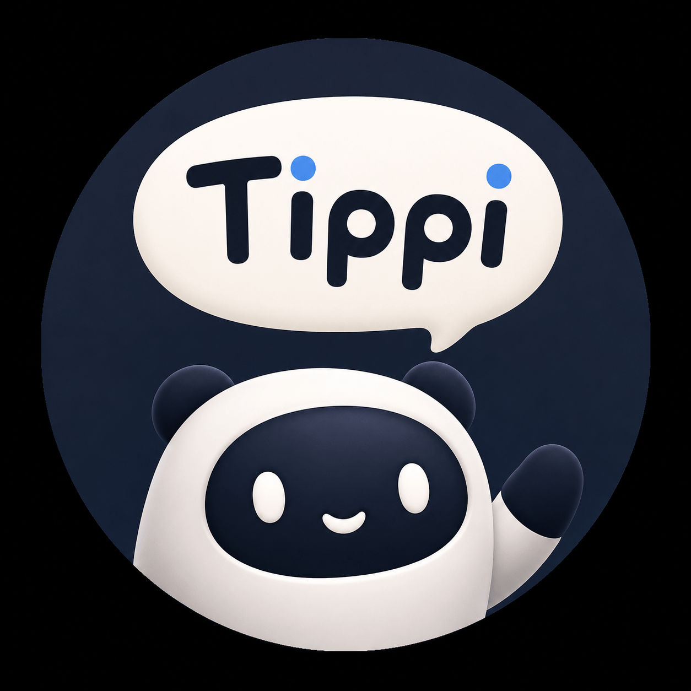
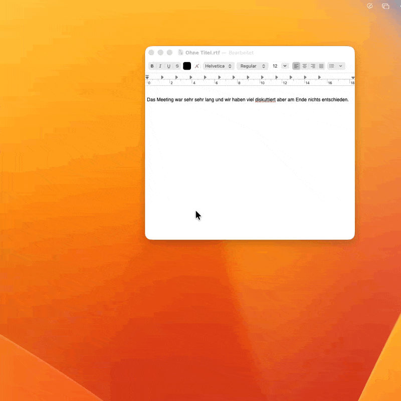

<p align="center">
  
</p>

# Tippi

[](https://github.com/miwixyz/Tippi/releases/latest)
[](#requirements)
[](LICENSE)

**🌐 Website:** [miwixyz.github.io/Tippi](https://miwixyz.github.io/Tippi/) (EN / DE) · **📄 One-pager:** [docs/ONE-PAGER.md](docs/ONE-PAGER.md)

**Tippi** is a system-wide AI writing assistant for macOS. Select text in any app, hit a hotkey, let AI transform it — improve writing, fix grammar, translate, shorten, lengthen, or run your own custom prompts. Results land back in your original app with one click. No text selected? Trigger the hotkey to record voice — Whisper transcribes locally, then optionally applies an AI prompt.

> Mark text anywhere. Hit ⌥⌘T. Let AI do the rest.



---

## Features

- **Works everywhere** — Mail, Safari, Notes, Slack, VS Code, Pages, every text field on macOS
- **22 built-in prompts** — Improve, Fix Grammar, Shorten, Lengthen, Make Formal, Make Casual, Simplify, Humanize, Summarize, TL;DR, Bullet points, Key points, Action items, Explain like I'm 10, Email reply, LinkedIn post, Instagram caption, Facebook post, Adapt for App, Translate → DE, Translate → EN, Translate → ES; language-aware prompts use `{language}`
- **Custom prompts** — write your own AI instructions for repeatable tasks (e.g. "Rewrite as Slack message", "Translate to Bavarian", "Convert to bullet list"); supports `{clipboard}`, `{app_name}`, `{language}`, `{selected_text}` variables resolved at trigger time
- **Import / Export custom prompts** — share prompt collections as `.tippipack` files; merge or replace on import
- **PopClip-style local quick actions** — instantly format or transform selected text without an AI call: Bold, Italic, Underline, Strikethrough, Uppercase, Lowercase, Capitalize Words, Underscore, Hyphenate, Brackets, Join Lines, Character Count, and Word Count
- **6 AI providers** — choose any combination, switch freely:
  - **OpenAI** (default: `gpt-5-mini`)
  - **Anthropic Claude** (default: `claude-haiku-4-5`)
  - **Google Gemini** (default: `gemini-2.5-flash`)
  - **Mistral** (default: `mistral-small-latest`, EU hosting available)
  - **Ollama** (local, fully offline)
  - **MLX** (local, Apple-Silicon-native, ~1.5–2× faster than Ollama) — Tippi manages a local `mlx_lm.server` on demand, defaults to the faster Llama 3.2 3B Fast/Balanced preset, keeps larger quality presets available, auto-starts on launch when MLX is your preferred provider, and shows generation time in the preview badge.
- **Voice Input** — trigger the hotkey with no text selected: a popup with a mic button appears, hold to record (push-to-talk), Whisper transcribes locally, the popup shows the transcript with AI prompt options and an "Insert directly" button
- **Free-form instruction — typed or spoken** — select text, trigger the hotkey, then type an instruction in the popup's input field (e.g. "reply to this email politely", "translate to Spanish") and press Return, or press the mic button and speak it. Tippi follows it literally: transform instructions (translate, summarize, shorten) operate on the text as-is, reaction instructions (reply, respond) produce an answer. The field auto-focuses; press ↓ to jump back to the prompt list
- **Dictation mode (v1.7+)** — a dedicated hotkey (default **⌃⌥⌘M**) starts recording, press again to stop; Whisper transcribes locally and inserts the text at the cursor — no popup, no text selection. A floating pill shows recording (with a live waveform), transcribing, and optional AI-cleanup state
- **Local Whisper transcription** — speech never leaves your Mac; model downloaded in-app (Settings → Voice); choose Tiny / Base / Small in English or multilingual
- **Streaming preview** — the AI result streams in token by token instead of appearing all at once after a wait (real streaming for OpenAI, Mistral, Scaleway, Groq; other providers show it in one piece)
- **Iterative refine** — once a result is ready, type a follow-up in the Refine field ("shorter", "more formal", "add a greeting") to rewrite it in place; chain as many refinements as you like
- **Preview before applying** — side-by-side original vs. AI suggestion, then Replace / Append / Copy / Regenerate, with keyboard shortcuts (Return = Replace, ⌘C = Copy, ⌘Return = Append, ⌘R = Regenerate, Esc = Cancel). A result that hits the model's length limit is kept and flagged "Cut off" rather than discarded
- **Optional provider fallback** — Providers tab → if your chosen provider fails (rate limit, server or network error), Tippi can retry the next configured provider; off by default since it sends your text to a second provider
- **Auto-updates via Sparkle 2** — menu bar → "Check for Updates…", automatic check at launch
- **Configurable global hotkey** — record any combination in Settings, or use macOS's built-in keyboard shortcut binding
- **Autostart at login**
- **Dark Mode + Light Mode** — fully adaptive UI; all surfaces use macOS semantic materials and system colors; brand palette has explicit dark-mode variants
- **DE + EN UI**
- **Encrypted local History (opt-in, v1.9+)** — turn it on in Settings → History to keep a searchable log of every AI transformation. The `input` and `output` fields are encrypted at rest with AES-GCM via CryptoKit; the 256-bit key lives in your macOS Keychain (no iCloud sync). Browse entries side-by-side in a detail sheet, export the full set as JSON or CSV, or wipe everything with a confirmation. Default **OFF** — nothing is written to disk until you opt in.
- **Privacy-first**:
  - **BYOK** (bring your own API key) — keys stored in macOS Keychain only
  - **No telemetry, no analytics, no crash reporting**
  - **No request history by default** — opt-in encrypted local History (AES-GCM, Keychain key, no cloud). When off (default) your text never leaves your Mac except to the AI provider you chose.
  - **Voice processing fully local** — Whisper runs on-device, no audio sent anywhere
  - **Open source** under MIT

---

## Requirements

- macOS 15 Sequoia or later
- Apple Silicon Mac (M1, M2, M3, M4)
- At least one AI provider:
  - An API key for OpenAI, Anthropic, Google Gemini, or Mistral, **or**
  - [Ollama](https://ollama.com) installed locally (free, no key required), **or**
  - **MLX** — no manual install needed; Settings → Providers → MLX → "Install MLX…" handles everything (`uv` + `mlx-lm`) from the app
- **Voice features** (optional): a Whisper model downloaded via Settings → Voice (in-app download, no manual install)

---

## Installation

### From the latest release

1. Download the latest **[Tippi-1.12.1.dmg](https://github.com/miwixyz/Tippi/releases/tag/v1.12.1)** (or any version from [Releases](https://github.com/miwixyz/Tippi/releases))
2. Open the DMG, drag **Tippi.app** to `/Applications`
3. Launch Tippi from your Applications folder
4. Follow the in-app setup wizard (grant Accessibility permission, optionally enter an API key)

Tippi checks for updates automatically at launch. You can also trigger a check manually via the menu bar icon → "Check for Updates…".

### From source

```bash
git clone https://github.com/miwixyz/Tippi.git
cd Tippi
brew install xcodegen
make open
```

Then build and run in Xcode (⌘R). Note: an unsigned build will have TCC permission quirks. For a stable signed build see [Building a release](#building-a-release) below.

For a local command-line build, `make build` writes to `build/Build/Products/Release/` and signs the app with your Developer ID certificate so the granted Accessibility permission survives rebuilds (a stable TCC identity tied to Team ID + bundle ID):

```bash
make build
open build/Build/Products/Release/Tippi.app
```

> Launch via `open` (or Finder), not by running the inner `Contents/MacOS/Tippi` binary directly — on macOS 26 a direct-binary launch breaks the bundle's TCC identity and Accessibility reads as not-granted.

---

## Quick start

### 1. Grant permissions

Tippi needs **Accessibility** permission to read selected text from other apps and paste results back. The wizard guides you to System Settings → Privacy & Security → Accessibility. Toggle **Tippi** on.

For Voice Input, macOS will also prompt for **Microphone** access on first use.

### 2. Add an AI provider

Menu bar ✏️ → **Settings → Providers** tab. Enter at least one API key. Recommended starting point:

- **Easiest cloud setup**: [platform.openai.com → API keys](https://platform.openai.com/api-keys), creates `sk-…`, paste into the OpenAI field
- **Free + private**: install [Ollama](https://ollama.com), then `ollama pull llama3.3` in Terminal — Tippi picks it up automatically with no key

### 3. Use it

In any app: select some text → press **⌥⌘T** (the default global hotkey).

Tippi's prompt menu appears at your cursor. Pick a transformation. The preview window shows your original and the AI suggestion side by side. Click **Ersetzen** (Replace) or press Enter — done.

**Important:** Tippi is **not** PopClip — marking text alone does **not** open the menu. You must press the hotkey (or use the menu bar → **Trigger Tippi…**).

### 3b. Local quick actions (v1.6+)

With text selected, the popup shows **Quick actions** above the AI prompts — instant, local transforms (no API call):

| Action | Effect |
|--------|--------|
| Bold / Italic / Underline / Strike | Rich text where supported; Markdown-style fallback in plain-text apps |
| Uppercase / Lowercase / Capitalize | Case changes |
| Underscore / Hyphenate / Brackets | `hello world` → `hello_world`, `hello-world`, `(hello world)` |
| Join Lines | Multi-line selection → single line |
| Characters / Words | Count only (inline message, text unchanged) |

A short confirmation toast appears near the cursor after a quick action runs. Toggle visibility: **Settings → General → Show local quick actions**.

**Best results:** native editors (**TextEdit**, **Notes**, Mail compose). Spotlight/search fields and some web inputs may not expose selection to Accessibility — use **TextEdit** to verify permissions.

### 4. Voice Input (bonus)

Press **⌥⌘T** with no text selected. A small popup with a mic button appears. Hold the button to record, release to transcribe. Whisper processes your audio locally. The popup shows the transcript — pick an AI prompt to transform it, or click "Insert directly" to paste as-is.

**Voice Instruction:** select text first, then hold the mic button in the popup and speak your instruction (e.g. "translate this to English"). Tippi applies it via AI — no prompt menu step.

To enable voice, download a Whisper model first: Settings → Voice → Download Model.

### 4b. Dictation mode (v1.7+)

A faster path for pure dictation, with no popup. Enable it in **Settings → Voice → Dictation Mode** and pick a hotkey (default **⌃⌥⌘M**). Then, in any text field: press the hotkey to start recording — a floating pill appears with a live waveform driven by your mic level — press again to stop. Tippi transcribes locally (Parakeet v3 or Whisper) and inserts the text at the cursor.

**Optional AI cleanup** (Settings → Voice → Post-process): Tippi sends the raw transcript through your active LLM provider to remove filler words (äh, ähm, halt, also, um, uh), add punctuation, and fix self-corrections. Only runs on inputs ≥ 50 characters; adds 1–3 s latency. If the model responds conversationally instead of cleaning, Tippi detects this and inserts the raw transcript with a toast — dictation never breaks.

Avoid combos macOS reserves (e.g. ⌥⌘D toggles the Dock) — Tippi can't receive a system-claimed shortcut.

### App compatibility

Tippi reads and writes text via the Accessibility API, falling back to a clipboard (⌘C/⌘V) round-trip. This covers native macOS apps (Mail, Notes, Safari, TextEdit, Pages) and Microsoft Office fully. **Dictation (insert at cursor) and text capture work everywhere, including Electron/Chromium apps** such as Obsidian, Claude, ChatGPT, Slack, and VS Code. One limitation: **transforming and replacing a *selection* in Electron/Chromium apps cannot be done in place** — those editors drop the live selection when the picker appears and ignore Accessibility text writes. Tippi detects this and, instead of appending, copies the result to the clipboard and shows a "Copied — press ⌘V to insert" toast. Use dictation there, or transform in a native app for in-place replacement.

---

## Configuration

### Global hotkey

**In-app** (Settings → Hotkeys): click the hotkey field, press your desired combination. Saved automatically.

If the in-app hotkey doesn't fire on your machine (self-signed builds can hit macOS TCC quirks), use the **macOS-native fallback** offered in Settings → Hotkeys → "Open macOS Keyboard Shortcuts":

1. macOS Settings → Keyboard → Keyboard Shortcuts → App Shortcuts → **+**
2. Application: **Tippi.app**
3. Menu title: exactly `Trigger Tippi…` (the `…` is one character, type Option+`.`)
4. Shortcut: your choice

This route always works because macOS does the binding, not Tippi.

**Safety hotkey:** **⌃⌥⌘T** (Control + Option + Command + T) always registers via Carbon and does not require Input Monitoring.

### Local build permissions (test builds)

`make build` signs with your Developer ID certificate, so the Accessibility grant has a stable TCC identity (Team ID + bundle ID) and persists across rebuilds — you grant it once.

1. **System Settings → Privacy & Security → Accessibility** → enable **Tippi**. If Tippi is not listed, add it via **+** → `build/Build/Products/Release/Tippi.app`.
2. Make sure only **one** `Tippi.app` with bundle ID `com.tippi.app` exists. A second copy (e.g. an old release in `/Applications`) creates a LaunchServices conflict that can bind the grant to the wrong bundle. Remove duplicates.
3. Launch via `open` / Finder, **not** the inner `Contents/MacOS/Tippi` binary — a direct-binary launch breaks the bundle's TCC identity on macOS 26.
4. If quick actions still fail in TextEdit: grant **Automation** → Tippi may control **System Events** (AppleScript fallback).
5. Restart Tippi after toggling permissions (`pkill -x Tippi` then reopen).
6. Reset if stuck: `tccutil reset Accessibility com.tippi.app`

### Default AI model

Settings → Providers → "Default Provider" picker. Tippi tries the chosen provider first. If it has no key, it falls through to the next configured one. Each provider also has a "Model" field — leave blank for the default (recommended in May 2026: `gpt-5-mini`, `claude-haiku-4-5`, `gemini-2.5-flash`, `mistral-small-latest`, `llama3.3`).

### Custom prompts

Settings → Prompts → "New prompt":

- **Title** — what appears in the popup menu (e.g. "Rewrite as Slack message")
- **SF Symbol** — icon next to the title (find names at [developer.apple.com/sf-symbols](https://developer.apple.com/sf-symbols))
- **Instructions for the AI** — system prompt sent to the model along with your selected text

Custom prompts appear in the popup alongside the built-ins. They use the same default provider.

#### Prompt variables

Use `{placeholders}` in your prompt instructions — Tippi resolves them at trigger time:

| Variable | Resolves to |
|----------|-------------|
| `{clipboard}` | Current clipboard content |
| `{app_name}` | App you triggered Tippi in (e.g. `Mail`, `Safari`, `Slack`) |
| `{language}` | Detected language of your selected text (e.g. `German`, `English`) |
| `{selected_text}` | The selected text itself — useful when you need to reference it explicitly inside the system prompt |

**App-aware tone** — one prompt, adapts to where you're writing:
```
Rewrite the following text for {app_name}.
In Slack: casual, max 2 sentences.
In Mail: formal with greeting.
Return only the result.
```

**Clipboard as style reference** — copy a sample text first, then select what you want to rewrite:
```
Match the tone and style of this reference from my clipboard:
{clipboard}

Rewrite the selected text in that style. Return only the result.
```

**Always stay in the right language** — works for any language, no hardcoding:
```
Improve the following text. Stay in {language}. Return only the improved version.
```

**Context-aware reply** — copy an email/message, then select your draft:
```
Context from clipboard: {clipboard}

This is a draft reply. Polish it so it fits the context above. Return only the improved reply.
```

#### Import / Export custom prompts

Share your custom prompts with teammates or between devices using `.tippipack` files (JSON under the hood):

- **Export all** — Settings → Prompts → "Export All" → saves `Tippi-Prompts.tippipack`
- **Export single** — click the ↑ icon next to any prompt → saves `Tippi-[Title].tippipack`
- **Import** — "Import" button → choose a `.tippipack` → pick **Merge** (keep existing) or **Replace** (overwrite); imported prompts always get fresh IDs to avoid conflicts

### Built-in prompts

Tippi ships with 11 ready-to-use prompts — all language-aware via `{language}`:

| Prompt | What it does |
|--------|-------------|
| **Improve** | Rewrites for better quality, same length and meaning |
| **Fix Grammar** | Corrects spelling, punctuation, grammar only — no rewording |
| **Shorten** | Trims ~30%, keeps all key information |
| **Lengthen** | Expands ~50% with relevant context and detail |
| **Make Formal** | Professional tone, no filler words |
| **Make Casual** | Conversational, natural language |
| **Simplify** | Short sentences, no jargon, no passive voice |
| **Summarize** | 3 concise bullet points with key info |
| **Adapt for App** | Tone adapts to `{app_name}` — casual for Slack/WhatsApp, formal for Mail, bullets for Notes |
| **Translate → DE** | German translation, preserves tone and formatting |
| **Translate → EN** | English translation, preserves tone and formatting |

### Voice / Whisper model

Settings → Voice → Download Model. Three sizes available:

| Model | Size | Speed | Notes |
|-------|------|-------|-------|
| Tiny  | ~75 MB | Fastest | Good for short commands, EN-only variant available |
| Base  | ~145 MB | Fast | Balanced accuracy/speed, recommended default |
| Small | ~465 MB | Slower | Best accuracy for long dictation or noisy environments |

Each size comes in an English-only or multilingual variant. English-only is faster if you only dictate in English.

### Autostart

Settings → General → "Launch Tippi at login". Wired through `SMAppService`, no login items entry needed.

---

## AI provider notes

| Provider  | Cost       | Speed   | Quality | Notes |
|-----------|------------|---------|---------|-------|
| OpenAI    | $          | Fast    | ★★★★   | Most popular. `gpt-5-mini` is the right balance. |
| Anthropic | $          | Fast    | ★★★★★  | Excellent prose quality. `claude-haiku-4-5` for fast tier. |
| Gemini    | Free tier  | Fast    | ★★★    | Generous free tier at `aistudio.google.com/apikey`. |
| Mistral   | $          | Fast    | ★★★★   | EU-hosted option for data-residency requirements. |
| Ollama    | **Free**   | ⚡ Hardware-dependent | ★★–★★★★ | Fully local. Privacy-best. Quality depends on model. |
| MLX       | **Free**   | ⚡⚡ ~1.5–2× faster than Ollama on Apple Silicon | ★★–★★★★ | Fully local, Apple-Silicon-native via Metal. Tippi manages the `mlx_lm.server` process. Auto-starts on launch when set as default. |

API keys are stored exclusively in the macOS Keychain (account `provider.<name>`, service `com.tippi.app`), not in plaintext anywhere on disk.

---

## Contributing

Bug reports and pull requests are welcome. For significant changes, please open an issue first.

**Building a signed release** (Apple Developer account required) is documented in [`CONTRIBUTING.md`](CONTRIBUTING.md).

---

## Architecture (short version)

- **Swift 5.10 / SwiftUI / AppKit bridges**, native macOS app, no third-party runtime dependencies
- **Menu-bar-only** (`LSUIElement = true`), no Dock icon, settings + welcome windows shown on demand
- **Hardened Runtime, no Sandbox** — required for cross-app text capture
- **Text capture**: Accessibility API first (`AXUIElementCopyAttributeValue` on focused element), Pasteboard ⌘C round-trip as fallback (with snapshot/restore to keep clipboard intact)
- **Hotkey**: `NSEvent.addGlobalMonitorForEvents(matching: .keyDown)` plus a Carbon `RegisterEventHotKey` backup. For self-signed builds, the macOS-native keyboard shortcut binding to the "Trigger Tippi…" menu item is the most reliable path.
- **LLM layer**: a `LLMProvider` protocol with six implementations (OpenAI, Anthropic, Gemini, Mistral, Ollama, MLX); `LLMRouter` picks the preferred configured provider with automatic fallthrough. The MLX provider additionally drives `MLXServerManager`, which spawns and supervises a local `mlx_lm.server` process and resolves the active model ID via `/v1/models`.
- **Voice layer**:
  - `AudioRecorder` — AVFoundation-based push-to-talk capture
  - `WhisperTranscriber` — wraps a statically linked `whisper-cli` binary bundled in the app; runs out-of-process, no dynamic library dependencies
  - `WhisperModelManager` — handles in-app model download, verification, and storage in Application Support
- **Auto-updates**: Sparkle 2 framework; appcast hosted on GitHub Gist, checked at launch and on demand

Full technical handover doc: [`docs/HANDOVER.md`](docs/HANDOVER.md).

---

## Privacy

Tippi is designed so your text never reaches anything except the AI provider you actively configured.

- **No telemetry, ever** — no analytics endpoint, no crash reporter
- **No request history persisted** — once a response is rendered, neither the input nor the output is written to disk
- **API keys**: macOS Keychain, accessible only to Tippi (no iCloud sync)
- **Logs**: only crash-level logs to `~/Library/Logs/Tippi/`, content strings redacted
- **App-container excluded from Spotlight indexing**
- **Voice processing fully local** — audio is passed directly to the bundled `whisper-cli` binary; nothing is sent to any network endpoint

Provider-specific privacy varies — review each provider's data policy if you handle sensitive content. **Ollama** and **MLX** run entirely locally for the strictest privacy posture — no text ever leaves your Mac.

---

## Roadmap

| Version | Status | Highlights |
|---------|--------|------------|
| v1.0.x  | ✅ Done | System-wide hotkey, popup, preview, 5 providers, custom prompts, autostart |
| v1.1.x  | ✅ Done | Voice Input, Voice Instruction, in-app Whisper download, Sparkle 2 auto-updates, brand refresh (mascot icon, `#3070F0` accent, `#020B1D` navy, adaptive dark/light bg) |
| v1.2    | ✅ Done | Prompt variables — `{clipboard}`, `{app_name}`, `{language}`, `{selected_text}` |
| v1.3    | ✅ Done | New built-in prompts (Formal, Casual, Simplify, Summarize, Adapt for App); Import/Export custom prompts as `.tippipack` |
| v1.4.x  | ✅ Done | MLX provider — local `mlx_lm.server`, ~1.5–2× faster than Ollama on Apple Silicon; auto-start + temperature tuning; Help/About drift check |
| v1.5.x  | ✅ Done | In-app MLX installer (one-click `uv` + `mlx_lm.server` from Settings); broader built-in prompt catalogue |
| v1.6    | ✅ Done | Voice mode refinements + dictation hotkey stabilisation |
| v1.7.x  | ✅ Done | Provider routing improvements, completion result metadata (`providerID`/`model`) |
| v1.8.x  | ✅ Done | Settings polish + multi-provider quality-of-life fixes |
| v1.9    | ✅ Done | Encrypted local **History** (opt-in, GRDB + CryptoKit AES-GCM field encryption, Keychain-backed 256-bit key, JSON/CSV export) — pivot away from SQLCipher |
| v1.10.x | ✅ Done | Defuse + Add-Emojis modes from Blitztext-App (v1.10.0); HotkeyRecorder TabView-race fix + Carbon-trigger persistence fix (v1.10.1); atomic `isHandlingTrigger`-flag against triple-trigger race that caused 2–5 s UI freeze (v1.10.2); 16-fix review hardening + faster Whisper (v1.10.3) |
| v1.11.x | ✅ Done | Parakeet v3 speech engine, beta (v1.11.0); paste in non-AppKit apps via non-activating panels + universal prompt role-boundary (v1.11.1) |
| v1.12.x | ✅ Done | Type **or** speak a free-form instruction; streaming preview; iterative refine; preview keyboard shortcuts; optional provider fallback; smarter default provider; provider de-dup + truncation guards + ~22 review fixes (v1.12.0); Parakeet v3 as the default speech engine (v1.12.1) |
| v2.0    | Planned | Cross-platform (Windows port, likely Rust/Tauri) |

Full version history → [CHANGELOG.md](CHANGELOG.md) (single source of truth).

---

## License

MIT — see [LICENSE](LICENSE).

## Credits

Built with Swift + SwiftUI + AppKit. AI provider APIs by OpenAI, Anthropic, Google, Mistral, the [Ollama](https://ollama.com) project, and [Apple's MLX](https://github.com/ml-explore/mlx-lm) framework via `mlx_lm.server`. Voice transcription via [whisper.cpp](https://github.com/ggerganov/whisper.cpp). Auto-updates via [Sparkle 2](https://sparkle-project.org). Tippi mascot and brand assets by Michael Wlr.

© 2026 Michael Wlr — MIT License
